# LangSmith

+ LangSmith provides a powerful way to track and debug our Python functions using the @traceable decorator. If we add @traceable to any function, it will automatically log details about that function's execution whenever it runs.
+ How does it work? Every time the function is called, LangSmith creates a run tree, which keeps track of the function's inputs, name, and other details. If the function succeeds or fails, that information is also recorded and sent to LangSmith. This process happens in the background, so it doesn't slow down our program. The result? You can easily trace and diagnose errors without affecting our app's performance.
+ Additionally, LangSmith allows we to attach metadata to runs. Metadata is just a set of key-value pairs that provide extra details about a function execution. For example, we can use metadata to store the version of our app, the environment where the function was run, or any other useful information. This makes it easy to filter and group runs in the LangSmith UI for better analysis.

## Tracing
### Types of Runs
+ LangSmith supports many different types of runs - we can specify what type our run is in the @traceable decorator. The types of runs are:
    + **LLM**: Invokes an LLM.
    + **Retriever**: Retrieves documents from databases or other sources.
    + **Tool**: Executes actions with function calls.
    + **Chain**: Combines multiple runs into a larger process.
    + **Prompt**: Hydrates a prompt to be used with an LLM.
    + **Parser**: Extracts structured data.
+ For streaming, we can "reduce" the outputs into the same format as the non-streaming version. This is currently only supported in Python. The following picture is a difference between before (left) and after (right) reduce.
    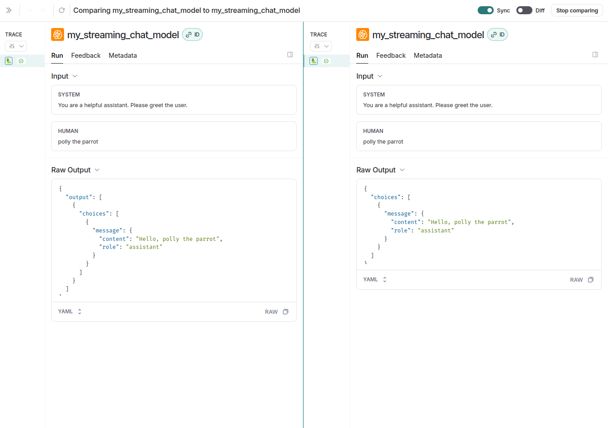

+ LangSmith provides special rendering for retrieval steps in traces to make it easier to understand and diagnose retrieval issues. In order for retrieval steps to be rendered correctly, a few small steps need to be taken.
    1) Annotate the retriever step with `run_type="retriever"`.
    2) Return a list of Python dictionaries or TypeScript objects from the retriever step. Each dictionary should contain the following keys:
        + `page_content`: The text of the document.
        + `type`: This should always be "Document".
        + `metadata`: A Python dictionary or TypeScript object containing metadata about the document. This metadata will be displayed in the trace.

+ LangSmith has custom rendering for Tool Calls made by the model to make it clear when provided tools are being used.
    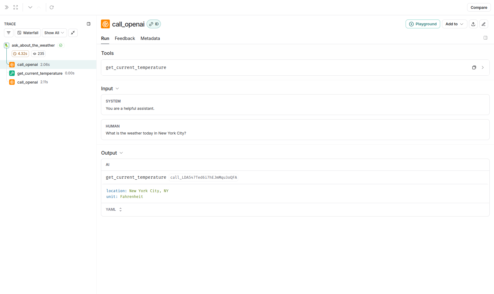
    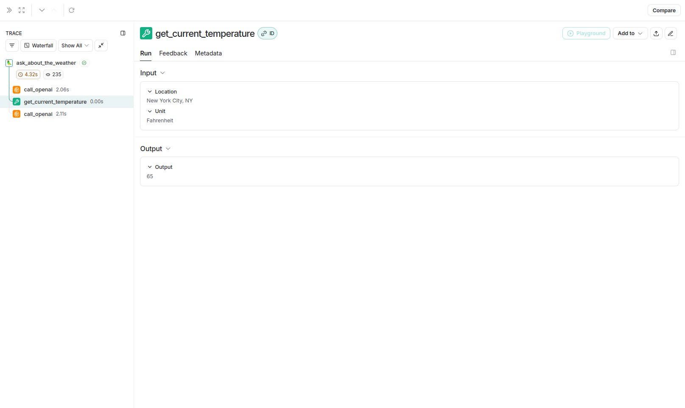
    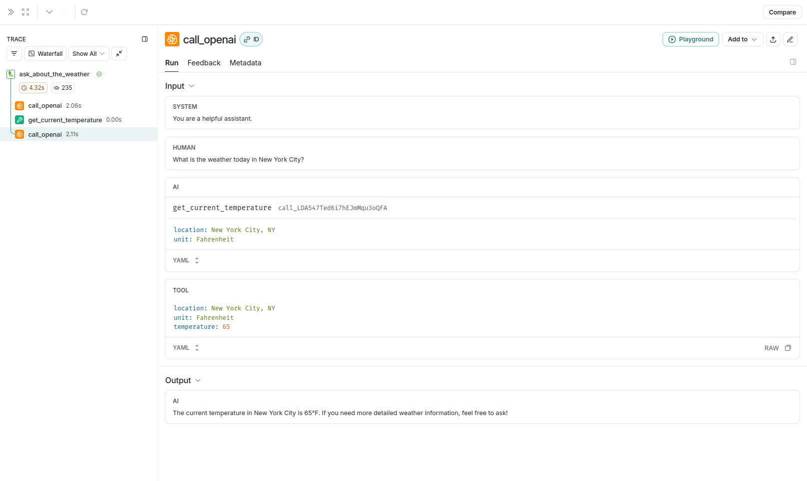

### Alternative Ways to Trace
+ Using `@traceable`: default way to set up tracing. Manages RunTree, inputs, and outputs for us.
+ Using directly LangChain or LangGraph library: automated tracing. No need to add any syntax in our code.
+ Using `with_trace()`: if we want more control over what inputs and outputs get logged (code: [with_trace.ipynb](with_trace.ipynb)). The following picture is a difference between using `@traceable` (above) and `with_trace()` (below).
    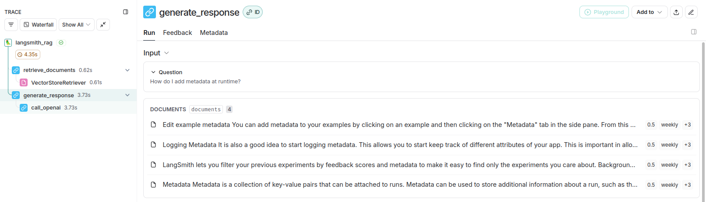
    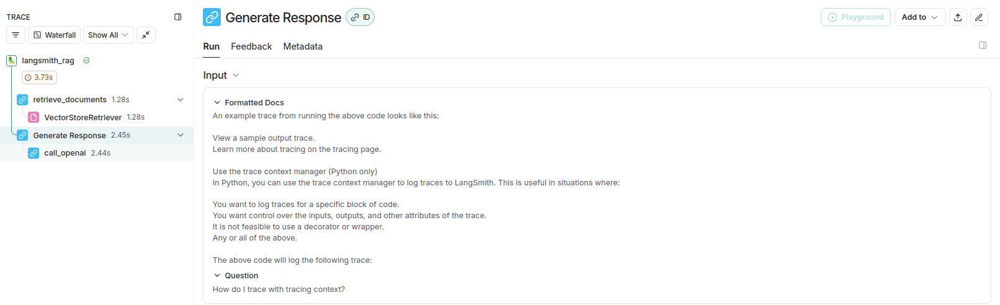
+ Using `wrap_openai()`: if we want tp use the OpenAI SDK directly (code: [wrap_openai.ipynb](wrap_openai.ipynb)). The following picture is a difference between using `wrap_openai()` (left) and `@traceable` (right).
    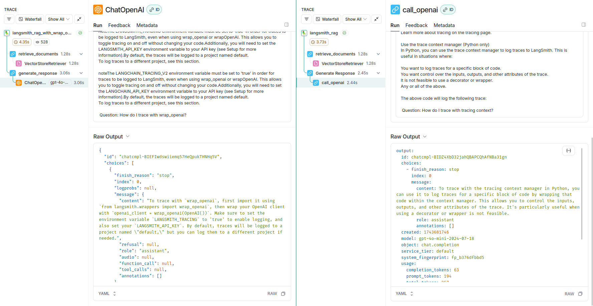
+ Using `RunTree`: if we want more low level control over tracing configuration (code: [runtree.ipynb](runtree.ipynb)).

### Conversational Thread
Many LLM applications have a chatbot-like interface in which the user and the LLM application engage in a multi-turn conversation. In order to track these conversations, we can use the Threads feature in LangSmith. A **Thread** is a sequence of traces representing a single conversation. Each response is represented as its own trace, but these traces are linked together by being part of the same thread. To associate traces together, we need to pass in a special metadata key where the value is the unique identifier for that thread. The key value is the unique identifier for that conversation. The key name should be one of `session_id`, `thread_id`, or `conversation_id`. The value should be a UUID. You can view the code at [conversational_threads.ipynb](conversational_threads.ipynb) and the result will be like:
    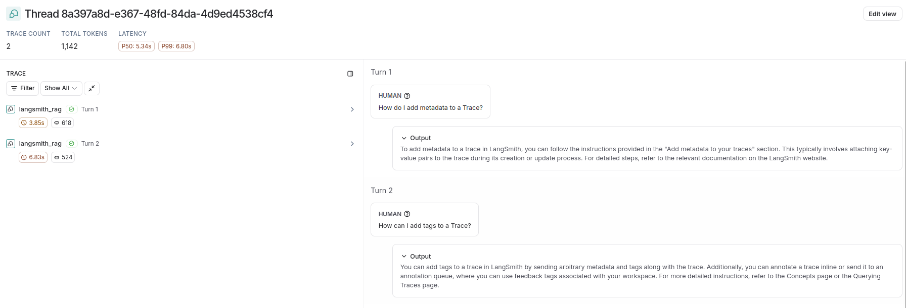

## Testng and Evaluation
### Datasets
Datasets are fundamentally a list of examples. Examples contains an input, and an optional output. Datasets in LangSmith UI:
    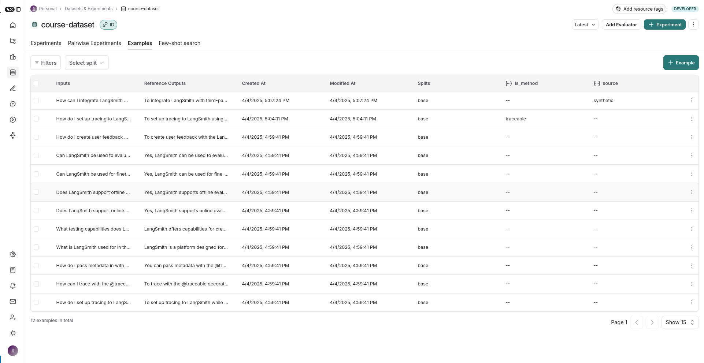
Examples in LangSmith UI:
    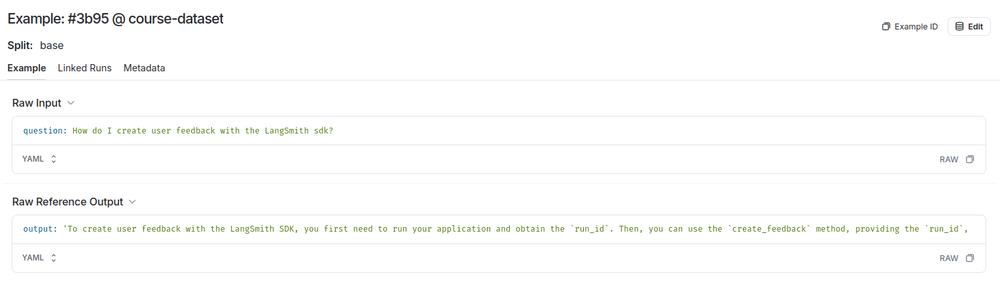

### Evaluators
+ At a high-level, an evaluator judges an invocation of our LLM application against a reference example, and returns an evaluation score. In LangSmith evaluators, we represent this process as a function that takes in a Run (representing the LLM app invocation) and an Example (representing the data point to evaluate), and returns Feedback (representing the evaluator's score of the LLM app invocation).
+ We can define Evaluators directly in local or LangSmith UI: LLM-as-judge evaluators and custom code evaluators.
+ LLM-as-judge evaluators use LLMs to score system output. To use them, we typically encode the grading rules or criteria in the LLM prompt. They can be reference-free (e.g., check if system output contains offensive content or adheres to specific criteria). Or, they can compare task output to a reference (e.g., check if the output is factually accurate relative to the reference). Here is an example of how we might define an LLM-as-judge evaluator with structured output: [llm_a_judge.ipynb](llm_a_judge.ipynb).

### Experiment
+ Experiment: Running our application over a dataset, and evaluating performance. 
+ Experimnet can be run over an entire dataset or:
    + A specific version 
        ```
        evaluate(
            target_function,
            data=client.list_examples(dataset_name=dataset_name, as_of="initial dataset"),   # we use as_of to specify a version
            evaluators=[is_concise_enough],
            experiment_prefix="initial dataset version"
        )
        ```
    + A split
        ```
        evaluate(
            target_function,
            data=client.list_examples(dataset_name=dataset_name, splits=["crucial examples"]),  # we pass in a list of splits
            evaluators=[is_concise_enough],
            experiment_prefix="crucial examples split"
        )
        ```
    + Spesific examples
        ```
        evaluate(
            target_function,
            data=client.list_examples(
                dataset_name=dataset_name, 
                example_ids=[   # we pass in a specific list of example_ids
                    "",
                    ""
                ]
            ),
            evaluators=[is_concise_enough],
            experiment_prefix="two specific example ids"
        )
        ```
+ Experiment can be run with other parameter:
    + Repetitions: We can run an experiment several times to make sure you have consistent results.
        ```
        evaluate(
            target_function,
            data=dataset_name,
            evaluators=[is_concise_enough],
            experiment_prefix="two repetitions",
            num_repetitions=2   # this field defaults to 1
        )
        ```
    + Concurrency: We can also kick off concurrent threads of execution to make your experiments finish faster.
        ```
        evaluate(
            target_function,
            data=dataset_name,
            evaluators=[is_concise_enough],
            experiment_prefix="concurrency",
            max_concurrency=3,  # this defaults to None, so this is an improvement
        )
        ```
    + Metadata: We can (and should) add metadata to your experiments, to make them easier to find in the UI.
        ```
        evaluate(
            target_function,
            data=dataset_name,
            evaluators=[is_concise_enough],
            experiment_prefix="metadata added",
            metadata={  # we can pass custom metadata for the experiment, such as the model name
                "model_name": MODEL_NAME
            }
        )
        ```
+ If we run the code in [experiments.ipynb](experiments.ipynb), the LangSmith UI will look like this:
    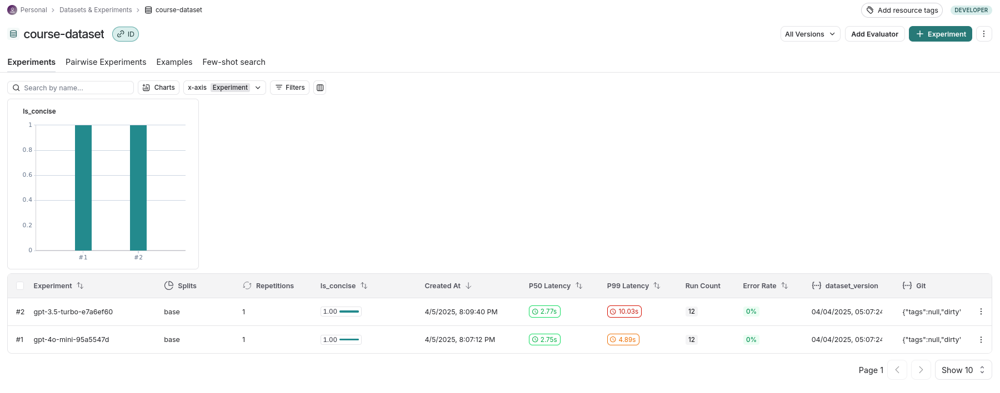
If we compare both experiments, the UI will appear as follows:
    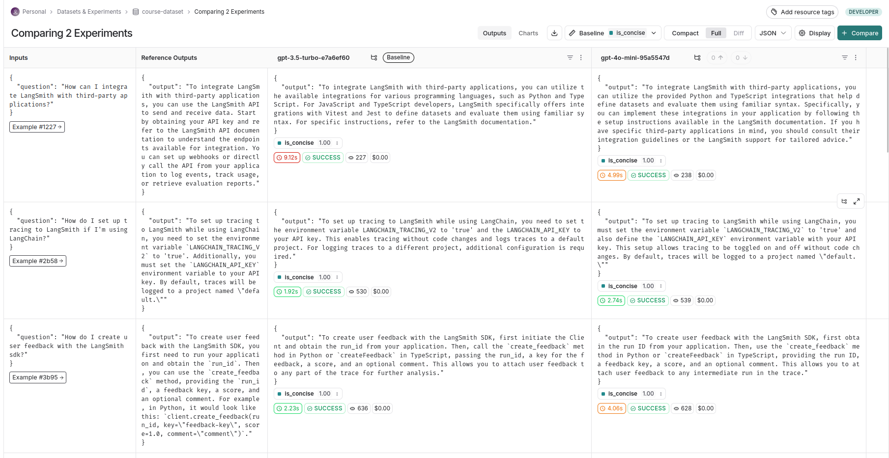
If we click on **Charts**, the UI will display:
    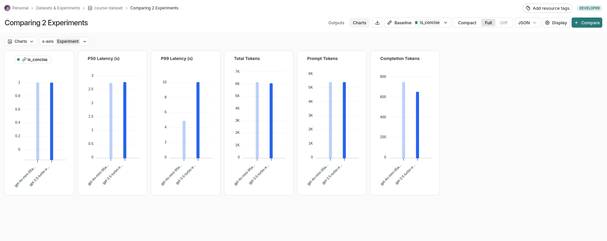
Experiment is very helpful for developers to monitor LLM applications efficiently.

### Online Evaluation
Case | Evaluator Example | Score Example 
--- | --- | --- 
For document retrieval tasks, check for hallucinations in the output. | `Check if this {answer} is grounded in these {documents}.` | `did_hallucinate = False`
Scrore the perceived helpfulness of an answer to a user. | `Score the perceived helpfulness of the {answer} to this {question} from 1-10.` | `helpfulness = 7`
For a Coding Assistant, check to see if the outputted code actually compiles and executes. | `Check if LLM output is a valid python code snippet that can execute with REPL.` | `code_is_valid = True`
Check that the output matches a certain structure. | `For an Email Assistant, regex match that we correctly signed the email "Best wishes, Yoon".` | `correctly_signed = True`

### Dashboard
+ We can use dashboards to create customized views for specific information that we are interested in. 
+ Dashboards can transcend tracing projects, so you can aggregate metrics across multiple projects.
+ Dashboards are a great way to create hih level views for stakeholders in our product to get a quick sense of how things are going.

The picture below is an example of a dashboard that monitors token usage.

